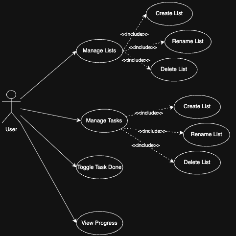
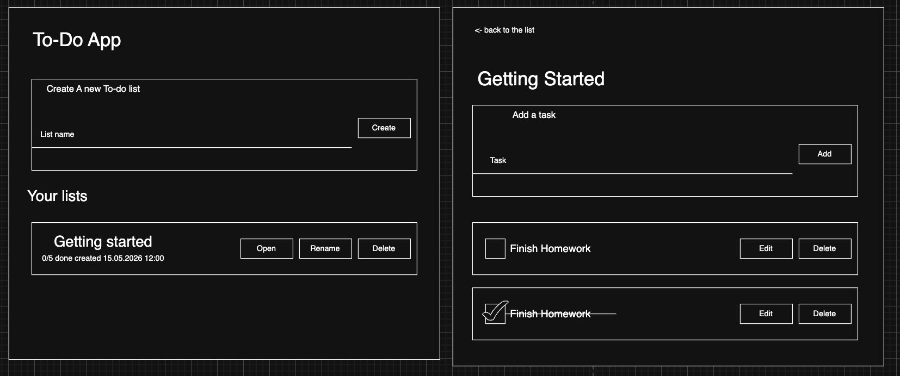
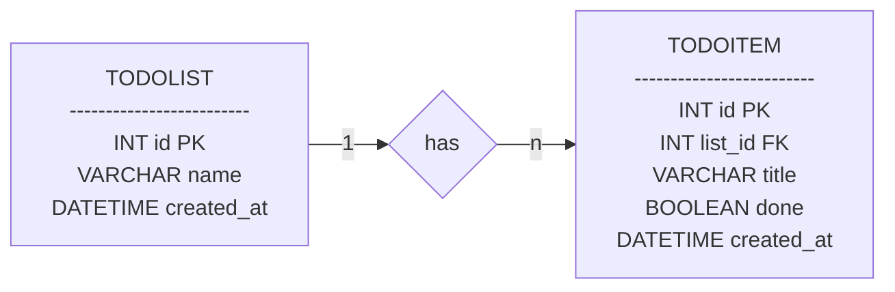
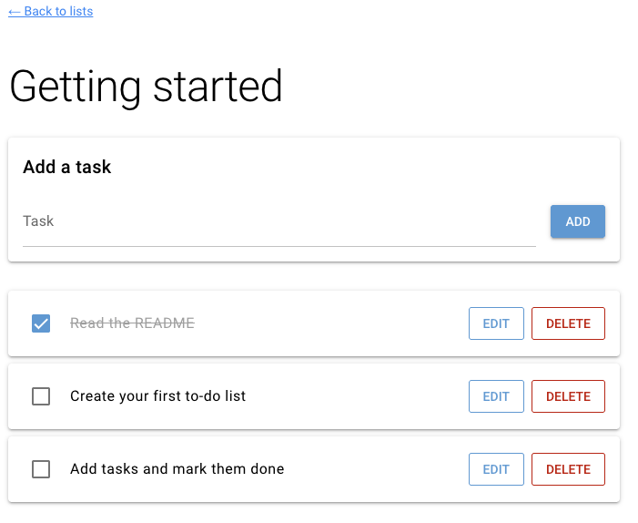

# ✅ To-Do App – Browser-Based Task Management (Browser App)


---

This project demonstrates the development of a browser-based application using **NiceGUI**, focusing on clean architecture, data validation, and database integration via an ORM.

It aims to:

- Cover the full process from **requirements analysis to implementation**
- Apply advanced **Python** concepts in a web-based application
- Demonstrate **data validation**, layered architecture, and ORM usage
- Produce clean, maintainable, and well-tested code
- Support **teamwork and professional documentation**

---

## 📝 Application Requirements

### Problem

People often keep tasks in scattered notes, sticky papers, or chat messages. This makes it hard to keep an overview, easy to forget what is still open, and impossible to share lists between devices.

---

### Scenario

The application allows users to:
- create named to-do lists (e.g. *Groceries*, *Uni*, *Home*)
- add, rename and delete tasks inside a list
- mark tasks as done (and un-mark them again)
- see how many tasks per list are still open
- store everything persistently in a database

---

## 📖 User Stories

### 1. Create a To-Do List
**As a user, I want to create a new to-do list with a name so I can group tasks by topic.**

- **Inputs:** list name (`str`, 1–80 chars)
- **Outputs:** new `TodoList`

---

### 2. View All To-Do Lists
**As a user, I want to see all my to-do lists with their progress (done / total).**

- **Inputs:** none
- **Outputs:** list of to-do lists (`list[TodoList]`) with per-list counts

---

### 3. Manage Tasks in a List
**As a user, I want to add, rename and delete tasks in a given list.**

- **Inputs:** list id (`int`), task title (`str`, 1–200 chars)
- **Outputs:** updated list of tasks (`list[TodoItem]`)

---

### 4. Mark Tasks as Done
**As a user, I want to tick a task as done (and un-tick it again) so I can track progress.**

- **Inputs:** item id (`int`)
- **Outputs:** updated `TodoItem` with new `done` state

---

### 5. Rename a List
**As a user, I want to rename an existing to-do list so I can correct mistakes or update its topic.**

- **Inputs:** list id (`int`), new name (`str`, 1–80 chars)
- **Outputs:** updated `TodoList`

---

### 6. Delete a List
**As a user, I want to delete a to-do list entirely, including all its tasks, so I can clean up my workspace.**

- **Inputs:** list id (`int`)
- **Outputs:** removed `TodoList`

---

## 🧩 Use Cases


### Main Use Cases
- Manage Lists (User) – create, rename, delete to-do lists
- Manage Tasks (User) – create, rename, delete tasks inside a list
- Toggle Task Done (User) – mark a task as done / not done
- View Progress (User) – see done / total per list

### Actors
- User (single role – everyone using the app has the same permissions)

---

### Wireframes / Mockups

---

## 🏛️ Architecture


### Layers
- **UI:** NiceGUI (browser-based interface)
- **Application logic:** controllers and services
- **Persistence:** SQLite + ORM + data access (DAO)

### Design Decisions
- MVC structure (Model–View–Controller)
- Clear separation of concerns
- Business logic independent of UI

### Design Patterns Used

- **Layered Architecture (MVC):** We cleanly separated the UI (NiceGUI), business logic (Services), and data (Models). This prevents messy code and makes the application much easier to test and modify.
- **Facade Pattern:** Hides the complex infrastructure boilerplate. It provides a simple interface for database setup, so the rest of the app doesn't need to worry about connection strings or session management.
- **Data Access Object (DAO):** Acts as a secure bridge to the database. By using DAOs, our service classes are kept clean and never have to deal with direct SQLModel queries or raw database sessions.

---

## 🗄️ Database and ORM



The application uses **SQLModel** to map domain objects to a SQLite database.

### Entities
- `TodoList`
- `TodoItem`

### Relationships
- One `TodoList` → many `TodoItem` (cascade delete: deleting a list removes its tasks)

---


## ✅ Project Requirements

---

Each app must meet the following criteria in order to be accepted (see also the official project guidelines PDF on Moodle):

1. Using NiceGUI for building an interactive web app
2. Data validation in the app
3. Using an ORM for database management

---

### 1. Browser-based App (NiceGUI)

The application interacts with the user via the browser. Users can:

- View all their to-do lists with progress
- Open a list to see its tasks
- Add, rename, delete and tick off tasks
- Rename or delete entire lists

**Architecture note:** the browser is a thin client; UI state + business logic live on the server-side NiceGUI app.

---

### 2. Data Validation

The application validates all user input to ensure data integrity and a smooth user experience.
These checks prevent crashes and guide the user to provide correct input, matching the validation requirements described in the project guidelines.

Concretely
- List names must be non-empty after trimming and at most 80 characters
- Task titles must be non-empty after trimming and at most 200 characters
- Updates / deletes on non-existent ids raise `ValueError` (shown as user-friendly `ui.notify` warnings)
- SQLModel field constraints (min/max length) enforce validation at the model level

---

### 3. Database Management

All relevant data is managed via an ORM (SQLModel on top of SQLAlchemy). For this app this includes to-do lists and to-do items, with a 1:N relationship and cascade delete. No raw SQL is written by hand.

---

## ⚙️ Implementation

### Technology

- Python 3.10+
- NiceGUI
- SQLModel / SQLAlchemy
- pytest

---

### 📚 Libraries Used

- **nicegui** – UI framework
- **sqlmodel** – ORM
- **sqlalchemy** – database toolkit
- **pytest** – testing

---

## 📂 Repository Structure

```text
todo_app/
├── __init__.py
├── __main__.py
├── application.py
├── data_access/
│   ├── __init__.py
│   ├── dao.py
│   ├── db.py
│   └── seed.py
├── domain/
│   ├── __init__.py
│   └── models.py
├── services/
│   ├── __init__.py
│   ├── todo_item_service.py
│   └── todo_list_service.py

└── ui/
    ├── __init__.py
    ├── controllers.py
    └── pages.py
```
---

### How to Run

### 1. Project Setup
- Python 3.10+ is required
- Create and activate a virtual environment:
   - **macOS/Linux:**
      ```bash
      python3 -m venv .venv
      source .venv/bin/activate
      ```
   - **Windows:**
      ```bash
      python -m venv .venv
      .venv\Scripts\Activate
      ```
- Install dependencies:
   ```bash
   pip install -r requirements.txt
   ```

### 2. Configuration
- No configuration required. The SQLite database is created automatically under `data/todo_app.db` on first start.
- Optional: set the `DATABASE_URL` environment variable to point to a different database.

### 3. Launch
- Start the NiceGUI app:
   ```bash
   python -m todo_app
   ```
- Open the URL printed in the console (default: <http://localhost:8080>).

### 4. Usage (document as steps)

Manage To-Do Lists:
1. Open the home page (`/`) to see all your lists.
2. Use the input + *Create* button to create a new list.
3. On each list card you can *Open*, *Rename* or *Delete* the list.


Manage Tasks:
1. Click *Open* on a list to go to the detail page (`/list/<id>`).
2. Use the input + *Add* button to add a new task.
3. Click the checkbox to toggle a task between *done* and *not done*.
4. Use *Edit* to rename a task, *Delete* to remove it.
   

---

## 🧪 Testing

## Test Cases

The project uses `pytest` for automated testing. The tests are divided into unit tests, database tests and integration tests.

### Test Mix

* 6 Unit tests: service validation and business logic
* 4 Database tests: DAO operations, seeded data and cascade delete
* 3 Integration tests: full controller to service to DAO to database workflow
* 13 tests in total

---

## Unit Tests

### TC_UNIT_001

**Automated test name:** `test_list_name_must_not_be_empty`

**Test case title:** Verify that a list name must not be empty

**Preconditions:**  
In memory SQLite database is available.

**Test steps:**  
1. Create `TodoListService`  
2. Call `create` with an empty list name  
3. Check if an error is raised  

**Test data/input:**  
List name: `"   "`

**Expected result:**  
A `ValueError` is raised.

**Actual result:**  
A `ValueError` is raised.

**Status:**  
Pass

**Comments:**  
Prevents empty list names from being stored.

---

### TC_UNIT_002

**Automated test name:** `test_list_name_too_long_is_rejected`

**Test case title:** Verify that a list name longer than 80 characters is rejected

**Preconditions:**  
In memory SQLite database is available.

**Test steps:**  
1. Create `TodoListService`  
2. Call `create` with a list name of 81 characters  
3. Check if an error is raised  

**Test data/input:**  
List name: `"x" * 81`

**Expected result:**  
A `ValueError` is raised.

**Actual result:**  
A `ValueError` is raised.

**Status:**  
Pass

**Comments:**  
Ensures list name length validation.

---

### TC_UNIT_003

**Automated test name:** `test_list_name_is_trimmed`

**Test case title:** Verify that spaces around a list name are removed

**Preconditions:**  
In memory SQLite database is available.

**Test steps:**  
1. Create `TodoListService`  
2. Create a list with leading and trailing spaces  
3. Check the saved list name  

**Test data/input:**  
List name: `"  Groceries  "`

**Expected result:**  
The list is saved as `"Groceries"`.

**Actual result:**  
The list is saved as `"Groceries"`.

**Status:**  
Pass

**Comments:**  
Confirms input trimming before storing the list name.

---

### TC_UNIT_004

**Automated test name:** `test_item_title_must_not_be_empty`

**Test case title:** Verify that a task title must not be empty

**Preconditions:**  
In memory SQLite database is available and a list exists.

**Test steps:**  
1. Create a list  
2. Try to add a task with an empty title  
3. Check if an error is raised  

**Test data/input:**  
List name: `"L"`  
Task title: `""`

**Expected result:**  
A `ValueError` is raised.

**Actual result:**  
A `ValueError` is raised.

**Status:**  
Pass

**Comments:**  
Prevents empty task titles from being stored.

---

### TC_UNIT_005

**Automated test name:** `test_item_title_too_long_is_rejected`

**Test case title:** Verify that a task title longer than 200 characters is rejected

**Preconditions:**  
In memory SQLite database is available and a list exists.

**Test steps:**  
1. Create a list  
2. Try to add a task with 201 characters  
3. Check if an error is raised  

**Test data/input:**  
List name: `"L"`  
Task title: `"x" * 201`

**Expected result:**  
A `ValueError` is raised.

**Actual result:**  
A `ValueError` is raised.

**Status:**  
Pass

**Comments:**  
Ensures task title length validation.

---

### TC_UNIT_006

**Automated test name:** `test_toggle_inverts_done_flag`

**Test case title:** Verify that toggling a task changes its done status

**Preconditions:**  
In memory SQLite database is available and a task exists.

**Test steps:**  
1. Create a list  
2. Add a task  
3. Toggle the task once  
4. Toggle the task again  
5. Check the done status after each toggle  

**Test data/input:**  
List name: `"L"`  
Task title: `"Buy milk"`

**Expected result:**  
The task changes from not done to done, and then back to not done.

**Actual result:**  
The task changes from not done to done, and then back to not done.

**Status:**  
Pass

**Comments:**  
Tests the basic task status logic.

---

## Database Tests

### TC_DB_001

**Automated test name:** `test_query_returns_seeded_list`

**Test case title:** Verify that the seeded database returns the inserted list

**Preconditions:**  
Seeded in memory SQLite database is available.

**Test steps:**  
1. Insert a sample list with two tasks  
2. Query all `TodoList` entries  
3. Check list count and list name  

**Test data/input:**  
List name: `"Sample"`  
Tasks: `"A"`, `"B"`

**Expected result:**  
One list exists with the name `"Sample"`.

**Actual result:**  
One list exists with the name `"Sample"`.

**Status:**  
Pass

**Comments:**  
Confirms that seeded test data is available.

---

### TC_DB_002

**Automated test name:** `test_dao_create_and_get_list`

**Test case title:** Verify that a list can be created and retrieved through the DAO

**Preconditions:**  
In memory SQLite database is available.

**Test steps:**  
1. Create `TodoListDAO`  
2. Create a new list  
3. Fetch the list by ID  
4. Check ID and name  

**Test data/input:**  
List name: `"My List"`

**Expected result:**  
The created list has an ID and can be fetched by the same ID.

**Actual result:**  
The created list has an ID and can be fetched by the same ID.

**Status:**  
Pass

**Comments:**  
Tests DAO create and read behavior for lists.

---

### TC_DB_003

**Automated test name:** `test_dao_create_item_and_list_for_list`

**Test case title:** Verify that tasks can be created and listed for a specific list

**Preconditions:**  
In memory SQLite database is available and a list exists.

**Test steps:**  
1. Create a list  
2. Add two tasks to the list  
3. Load all tasks for the list  
4. Check the task titles  

**Test data/input:**  
List name: `"L"`  
Tasks: `"Task 1"`, `"Task 2"`

**Expected result:**  
The returned tasks are `"Task 1"` and `"Task 2"`.

**Actual result:**  
The returned tasks are `"Task 1"` and `"Task 2"`.

**Status:**  
Pass

**Comments:**  
Tests DAO item creation and the relation between lists and tasks.

---

### TC_DB_004

**Automated test name:** `test_deleting_list_cascades_to_items`

**Test case title:** Verify that deleting a list also deletes its tasks

**Preconditions:**  
In memory SQLite database is available and a list with one task exists.

**Test steps:**  
1. Create a list  
2. Add a task  
3. Delete the list  
4. Query the remaining tasks  

**Test data/input:**  
List name: `"To be deleted"`  
Task title: `"leftover"`

**Expected result:**  
The list is deleted and no orphaned tasks remain.

**Actual result:**  
The list is deleted and no orphaned tasks remain.

**Status:**  
Pass

**Comments:**  
Confirms cascade delete behavior.

---

## Integration Tests

### TC_INT_001

**Automated test name:** `test_full_crud_flow_on_list_and_items`

**Test case title:** Verify full CRUD flow for lists and tasks

**Preconditions:**  
Empty in memory SQLite database is available.

**Test steps:**  
1. Create a list  
2. Read all lists  
3. Rename the list  
4. Add two tasks  
5. Toggle one task  
6. Check progress  
7. Rename a task  
8. Delete a task  
9. Delete the list  

**Test data/input:**  
List: `"Groceries"`  
Renamed list: `"Weekly groceries"`  
Tasks: `"Milk"`, `"Bread"`  
Renamed task: `"Whole-grain bread"`

**Expected result:**  
The list and tasks are created, updated, tracked and deleted correctly.

**Actual result:**  
The list and tasks are created, updated, tracked and deleted correctly.

**Status:**  
Pass

**Comments:**  
Tests the complete controller to service to DAO to database workflow.

---

### TC_INT_002

**Automated test name:** `test_renaming_nonexistent_list_raises`

**Test case title:** Verify that renaming a non existing list raises an error

**Preconditions:**  
Empty in memory SQLite database is available.

**Test steps:**  
1. Create controller  
2. Try to rename a list with an invalid ID  
3. Check if an error is raised  

**Test data/input:**  
List ID: `999`  
New name: `"Nope"`

**Expected result:**  
A `ValueError` is raised.

**Actual result:**  
A `ValueError` is raised.

**Status:**  
Pass

**Comments:**  
Confirms error handling for invalid list IDs.

---

### TC_INT_003

**Automated test name:** `test_deleting_nonexistent_item_raises`

**Test case title:** Verify that deleting a non existing task raises an error

**Preconditions:**  
Empty in memory SQLite database is available.

**Test steps:**  
1. Create controller  
2. Try to delete a task with an invalid ID  
3. Check if an error is raised  

**Test data/input:**  
Task ID: `999`

**Expected result:**  
A `ValueError` is raised.

**Actual result:**  
A `ValueError` is raised.

**Status:**  
Pass

**Comments:**  
Confirms error handling for invalid task IDs.

---

## 👥 Team & Contributions

- Planning and project structure developed together  
- Main implementation done through pair programming via GitHub 
- Presentation design: Leandro  
- Testing: Gabriel  
- README: Thikal

---

## 📝 License

This project is provided for **educational use only** as part of the Advanced Programming module.

[MIT License](LICENSE)

