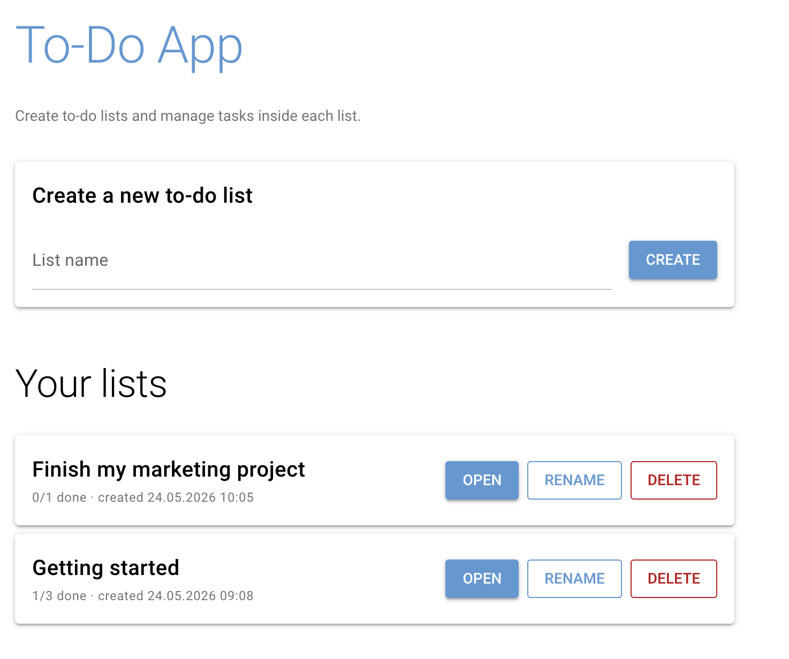
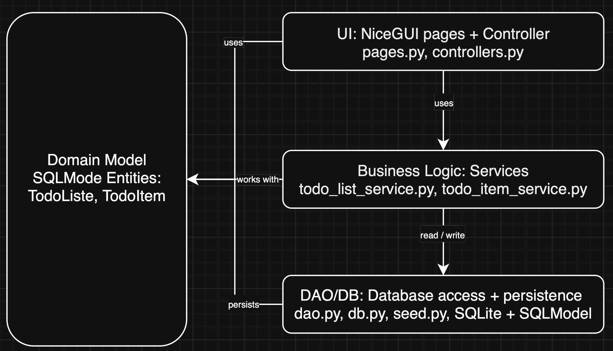

# ✅ To-Do App – Browser-Based Task Management (Browser App)



---

This project demonstrates the development of a browser-based application using **NiceGUI**, focusing on clean architecture, data validation, and database integration via an ORM.

It aims to:

- Cover the full process from **requirements analysis to implementation**
- Apply advanced **Python** concepts in a web-based application
- Demonstrate **data validation**, layered architecture, and ORM usage
- Produce clean, maintainable, and well-tested code
- Support **teamwork and professional documentation**

---

## 📝 Application Requirements

### Problem

People often keep tasks in scattered notes, sticky papers, or chat messages. This makes it hard to keep an overview, easy to forget what is still open, and impossible to share lists between devices.

---

### Scenario

The application allows users to:
- create named to-do lists (e.g. *Groceries*, *Uni*, *Home*)
- add, rename and delete tasks inside a list
- mark tasks as done (and un-mark them again)
- see how many tasks per list are still open
- store everything persistently in a database

---

## 📖 User Stories

### 1. Create a To-Do List
**As a user, I want to create a new to-do list with a name so I can group tasks by topic.**

- **Inputs:** list name (`str`, 1–80 chars)
- **Outputs:** new `TodoList`

---

### 2. View All To-Do Lists
**As a user, I want to see all my to-do lists with their progress (done / total).**

- **Inputs:** none
- **Outputs:** list of to-do lists (`list[TodoList]`) with per-list counts

---

### 3. Manage Tasks in a List
**As a user, I want to add, rename and delete tasks in a given list.**

- **Inputs:** list id (`int`), task title (`str`, 1–200 chars)
- **Outputs:** updated list of tasks (`list[TodoItem]`)

---

### 4. Mark Tasks as Done
**As a user, I want to tick a task as done (and un-tick it again) so I can track progress.**

- **Inputs:** item id (`int`)
- **Outputs:** updated `TodoItem` with new `done` state

---

### 5. Rename a List
**As a user, I want to rename an existing to-do list so I can correct mistakes or update its topic.**

- **Inputs:** list id (`int`), new name (`str`, 1–80 chars)
- **Outputs:** updated `TodoList`

---

### 6. Delete a List
**As a user, I want to delete a to-do list entirely, including all its tasks, so I can clean up my workspace.**

- **Inputs:** list id (`int`)
- **Outputs:** removed `TodoList`

---

## 🧩 Use Cases


### Main Use Cases
- Manage Lists (User) – create, rename, delete to-do lists
- Manage Tasks (User) – create, rename, delete tasks inside a list
- Toggle Task Done (User) – mark a task as done / not done
- View Progress (User) – see done / total per list

### Actors
- User (single role – everyone using the app has the same permissions)

---

### Wireframes / Mockups

> 🚧 Add screenshots of the wireframe mockups you chose to implement.

---

## 🏛️ Architecture

### Layers
- **UI:** NiceGUI (browser-based interface)
- **Application logic:** controllers and services
- **Persistence:** SQLite + ORM + data access (DAO)

### Design Decisions
- MVC structure (Model–View–Controller)
- Clear separation of concerns
- Business logic independent of UI

### Design Patterns Used
- Model-View-Controller / Layered MVC Variant: MVC makes sense here because the application has a graphical user interface, user interactions, business objects, and database access. Separating these responsibilities makes the project easier to understand, test, and extend.
- Facade Pattern: Facade makes sense because database setup involves several technical details. The rest of the application should not need to know how the database engine, tables, initial data, and sessions are created.
- Data Access Object (DAO): DAOs encapsulate all ORM queries so services never touch SQL or sessions directly.

---

## 🗄️ Database and ORM

The application uses **SQLModel** to map domain objects to a SQLite database.

### Entities
- `TodoList`
- `TodoItem`

### Relationships
- One `TodoList` → many `TodoItem` (cascade delete: deleting a list removes its tasks)

---


## ✅ Project Requirements

---

> 🚧 Requirements act as a contract: implement and demonstrate each point below.

Each app must meet the following criteria in order to be accepted (see also the official project guidelines PDF on Moodle):

1. Using NiceGUI for building an interactive web app
2. Data validation in the app
3. Using an ORM for database management

---

### 1. Browser-based App (NiceGUI)

> 🚧 In this section, document how your project fulfills each criterion.

The application interacts with the user via the browser. Users can:

- View all their to-do lists with progress
- Open a list to see its tasks
- Add, rename, delete and tick off tasks
- Rename or delete entire lists

**Architecture note (per SS26 guidelines):** the browser is a thin client; UI state + business logic live on the server-side NiceGUI app.

---

### 2. Data Validation

The application validates all user input to ensure data integrity and a smooth user experience.
These checks prevent crashes and guide the user to provide correct input, matching the validation requirements described in the project guidelines.

Concretely:
- List names must be non-empty after trimming and at most 80 characters
- Task titles must be non-empty after trimming and at most 200 characters
- Updates / deletes on non-existent ids raise `ValueError` (shown as user-friendly `ui.notify` warnings)
- SQLModel field constraints (min/max length) enforce validation at the model level

---

### 3. Database Management

All relevant data is managed via an ORM (SQLModel on top of SQLAlchemy). For this app this includes to-do lists and to-do items, with a 1:N relationship and cascade delete. No raw SQL is written by hand.

---

## ⚙️ Implementation

### Technology

- Python 3.10+
- NiceGUI
- SQLModel / SQLAlchemy
- pytest

---

### 📚 Libraries Used

- **nicegui** – UI framework
- **sqlmodel** – ORM
- **sqlalchemy** – database toolkit
- **pytest** – testing

---

## 📂 Repository Structure

```text
todo_app/
├── __init__.py
├── __main__.py
├── application.py
├── data_access/
│   ├── __init__.py
│   ├── dao.py
│   ├── db.py
│   └── seed.py
├── domain/
│   ├── __init__.py
│   └── models.py
├── services/
│   ├── __init__.py
│   ├── todo_item_service.py
│   └── todo_list_service.py

└── ui/
    ├── __init__.py
    ├── controllers.py
    └── pages.py
```
---

### How to Run

> 🚧 Adjust to your project.

### 1. Project Setup
- Python 3.10+ is required
- Create and activate a virtual environment:
   - **macOS/Linux:**
      ```bash
      python3 -m venv .venv
      source .venv/bin/activate
      ```
   - **Windows:**
      ```bash
      python -m venv .venv
      .venv\Scripts\Activate
      ```
- Install dependencies:
   ```bash
   pip install -r requirements.txt
   ```

### 2. Configuration
- No configuration required. The SQLite database is created automatically under `data/todo_app.db` on first start.
- Optional: set the `DATABASE_URL` environment variable to point to a different database.

### 3. Launch
- Start the NiceGUI app:
   ```bash
   python -m todo_app
   ```
- Open the URL printed in the console (default: <http://localhost:8080>).

### 4. Usage (document as steps)

> 🚧 Describe the usage of the main functions

Manage To-Do Lists:
1. Open the home page (`/`) to see all your lists.
2. Use the input + *Create* button to create a new list.
3. On each list card you can *Open*, *Rename* or *Delete* the list.

Manage Tasks:
1. Click *Open* on a list to go to the detail page (`/list/<id>`).
2. Use the input + *Add* button to add a new task.
3. Click the checkbox to toggle a task between *done* and *not done*.
4. Use *Edit* to rename a task, *Delete* to remove it.

> 🚧 Add UI screenshots of the main screens (or a short video link).

---

## 🧪 Testing

> 🚧 Explain what you test and how to run tests.

**Test mix:**
- Overall 13 tests
- 6 Unit tests: list name validation (empty / too long / trimmed), task title validation (empty / too long), toggle inverts done flag
- 4 DB tests: seeded query returns inserted list, DAO create + get for lists, DAO create + list-for-list for items, deleting a list cascades to items
- 3 Integration tests: full CRUD flow (create list → add items → toggle → rename → delete), renaming a non-existent list raises, deleting a non-existent item raises

Run the tests from the project root:
```bash
pytest
```

**Template for writing test cases**
1. Test case ID – unique identifier (e.g., TC_001)
2. Test case title/description – What is the test about?
3. Preconditions: Requirements before executing the test
4. Test steps: Actions to perform
5. Test data/input
6. Expected result
7. Actual result
8. Status – pass or fail
9. Comments – Additional notes or defect found

---

## 👥 Team & Contributions

> 🚧 Fill in the names of all team members and describe their individual contributions below.

| Name      | Contribution |
|-----------|--------------|
| Student A | NiceGUI UI + documentation |
| Student B | Database & ORM + documentation |
| Student C | Business logic + documentation |

---

## 📝 License

This project is provided for **educational use only** as part of the Advanced Programming module.

[MIT License](LICENSE)

